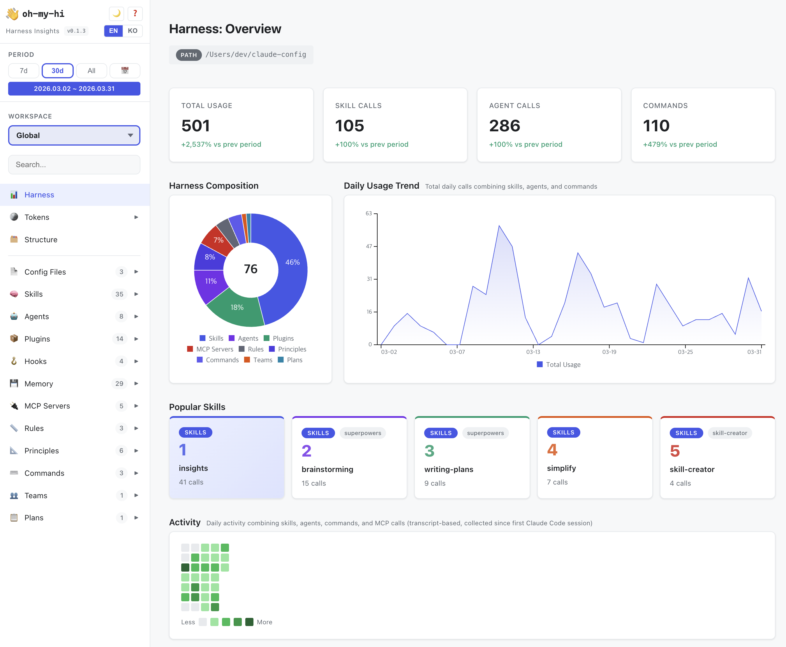
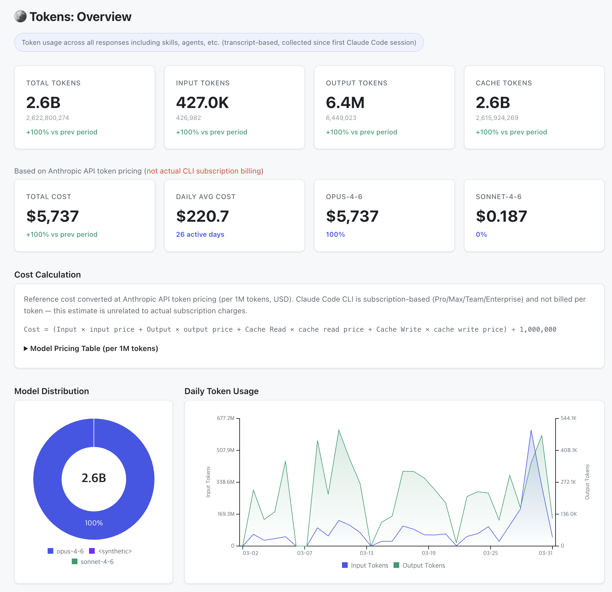
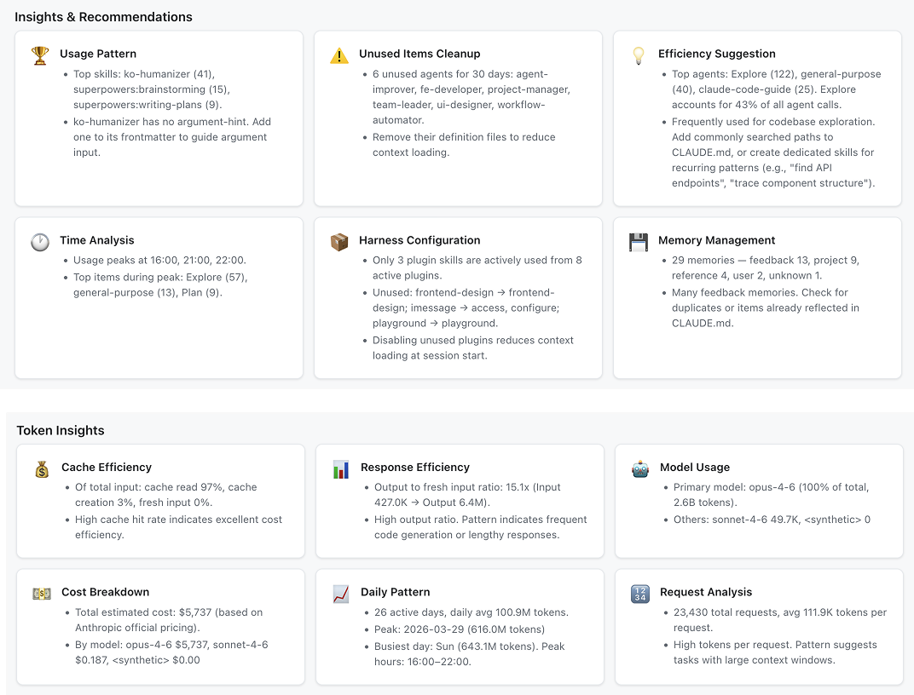
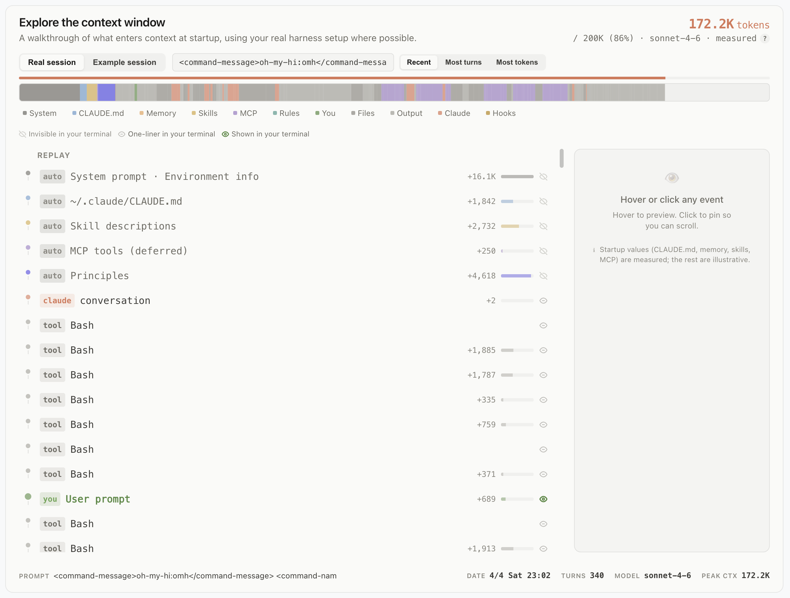
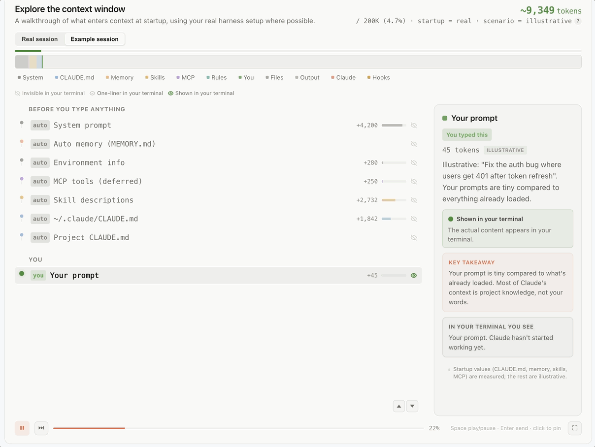

# 👋 oh-my-hi (Oh My Harness Insights)


> **Oh, so that's what Claude's been doing!** — A visual dashboard for your Claude Code harness.

Parses your entire Claude Code configuration and usage data, then generates an interactive single-file HTML dashboard you can open locally.



## What it shows

- **Harness overview** — skills, agents, plugins, hooks, memory, MCP servers, rules, principles, commands, teams, plans
- **Token analytics** — usage by model, daily trends, cache efficiency, prompt statistics, response latency
- **Context Window Explorer** — replay any past session turn-by-turn to see exactly how the context window filled up
- **Activity heatmaps** — daily usage patterns across skills, agents, and commands
- **Task categories** — auto-classified token usage by work type (code editing, docs, planning, etc.)
- **Multi-workspace** — switch between global and per-project scopes




### Context Window Explorer

Pick a real session from your Claude Code history and replay it turn-by-turn. The explorer breaks down every API turn into its contribution to the context window — system prompt, CLAUDE.md, memory, skill descriptions, MCP tools, user prompts, model responses, tool calls — so you can see exactly where your tokens went and when `/compact` kicked in.



You can also view a guided example session to walk through the mechanics before loading your own:



## Installation

#### From the Command Line

```bash
claude plugin marketplace add netil/oh-my-hi
claude plugin install oh-my-hi
```

#### Claude Code (in-session)

```bash
/plugin marketplace add netil/oh-my-hi
/plugin install oh-my-hi@oh-my-hi
```

## Usage

Run in Claude Code:

```
/omh
```

This will parse your harness data, build the dashboard, and open it in your browser.

### Parameters

| Command | Description |
|---------|-------------|
| `/omh` | Full build — parse data, build web-ui, open in browser |
| `/omh --data-only` | Lightweight data collection (skip dashboard build) |
| `/omh --enable-auto` | Auto-rebuild on session end (registers Stop hook) |
| `/omh --disable-auto` | Disable auto-rebuild |
| `/omh --update` | Check and install latest version |
| `/omh --status` | Check auto-rebuild status |
| `/omh <path>` | Build with specific project paths only |

### Auto-refresh

Enable automatic data refresh so the dashboard stays up to date:

```
/omh --enable-auto
```

This registers a Stop hook that collects data whenever a Claude Code session ends. The dashboard data (`data.js`) is updated incrementally — just refresh the browser tab to see the latest data.

### Update

```
/omh --update
```

Checks for new versions and updates the plugin. An update check also runs automatically once per day when using `/omh`.

## Guide

See **[GUIDE.md](GUIDE.md)** for a detailed walkthrough of each dashboard section — overview, token analytics, cost estimation, structure view, category pages, and more.

## How it works

1. **Parse** — Reads your Claude Code config directory for skills, agents, plugins, hooks, memory, MCP servers, rules, principles, commands, teams, plans, and usage transcripts
2. **Analyze** — Extracts token usage, prompt stats, response latency, activity patterns from `.jsonl` transcripts
3. **Classify** — Auto-categorizes token usage into work types (code editing, docs, planning, etc.) based on skill/agent descriptions. Saves to `task-categories.json` for user customization
4. **Build** — Generates `index.html` (shell with CSS/JS) + `data.js` (minified data). Data is separated from the shell so that only data needs updating on refresh
5. **Open** — On macOS, reuses an existing browser tab if found (AppleScript). On Windows/Linux, opens a new tab

## i18n

- **English**: Built-in default
- **Other languages**: A template locale file is auto-generated on first build. Translate it and rebuild

## Privacy

All data stays on your machine. `oh-my-hi` reads only local Claude Code config files and transcripts — nothing is sent to external servers. The generated dashboard is a standalone HTML file opened via `file://` protocol, with no network requests. Your usage data, token statistics, and configuration details never leave your local environment.

## Browser support

The dashboard opens as a local `file://` HTML file. No web server required.

On macOS, subsequent builds will refresh the existing browser tab instead of opening a new one (Chrome and Safari supported).

## License

[MIT](LICENSE)
